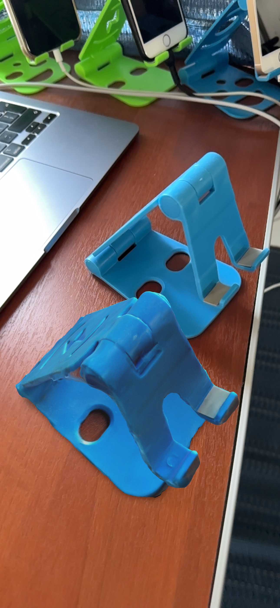

# lpdev.pro
Personal iOS/Android/Web dev blog

<html lang="en">
<body>
  

    <iframe width="560" height="315" src="https://www.youtube.com/embed/eTa9EN42a7o?si=rbW4vsqZ7g8YegVq&amp;controls=0" title="YouTube video player" frameborder="0" allow="accelerometer; autoplay; clipboard-write; encrypted-media; gyroscope; picture-in-picture;" allowfullscreen></iframe>
  

  

     
    

      Telegram: <a href="https://t.me/anovi" target="_blank">@anovi</a>  
    

  

   

<h3>LiDAR Examples</h3>
    

        

            Here are two photos from virtual reality with a copy of an existing object.
            Which one do you think is a real one?
        

        

            
            
        

    

    

        

            Here is example of the App that is using LiDAR for distance measuring:
        

        

            
        

    

<h3>AR Examples</h3>
    

        

        

        

            
            
        

    

<h3>AR Examples</h3>
    

        
        
    

    

        
        
    

</body>

</html>
